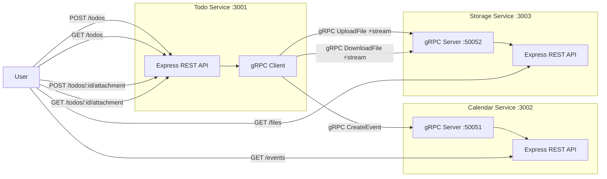
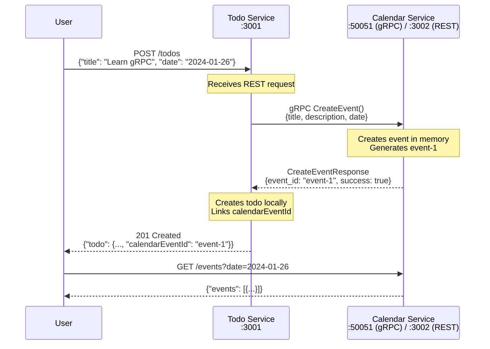
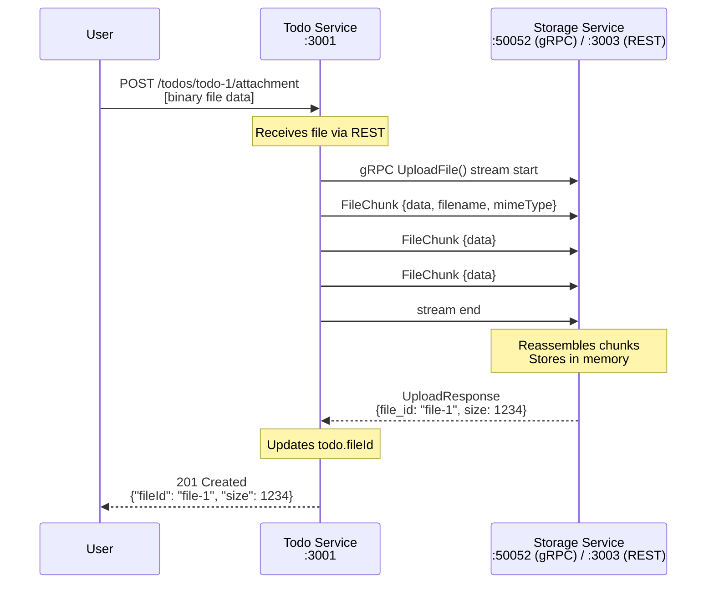
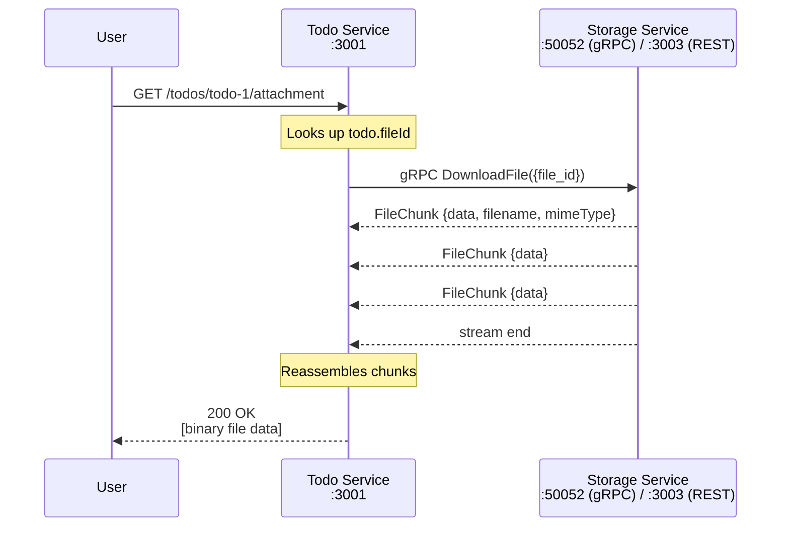
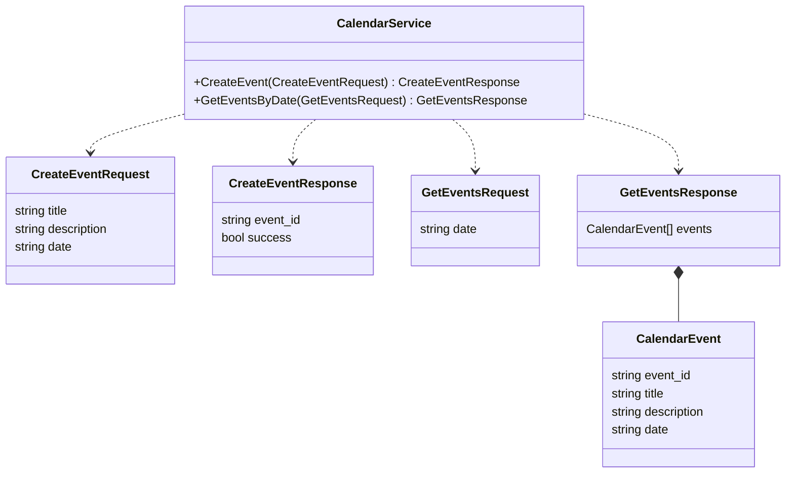
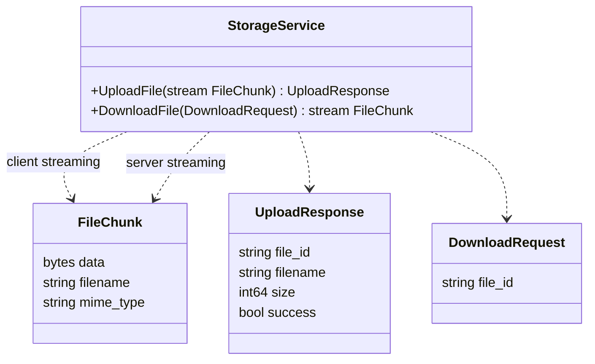
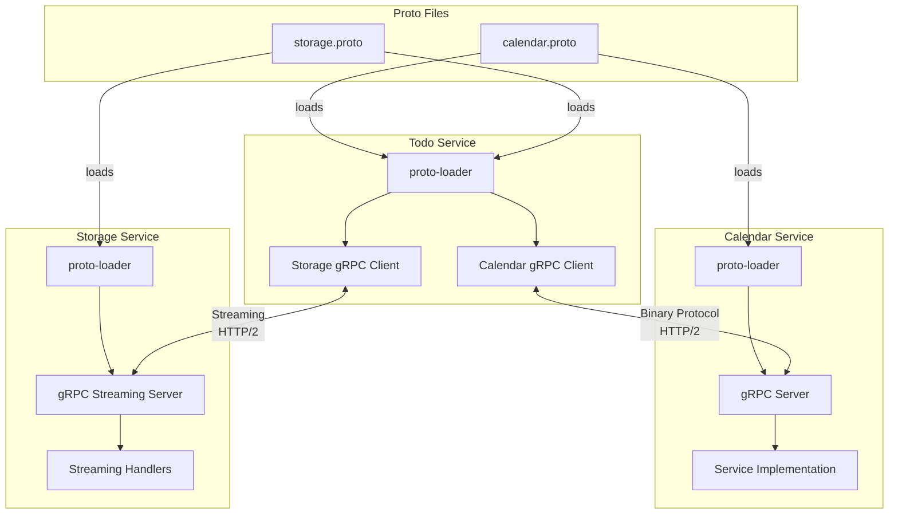

# gRPC Learning Project: Todo + Calendar + Storage Microservices

Three Express servers communicating via gRPC to demonstrate internal microservice communication, including **streaming RPCs** for file uploads/downloads.

## Architecture Overview



## Request Flow: Creating a Todo



## Request Flow: Uploading an Attachment (Client Streaming)



## Request Flow: Downloading an Attachment (Server Streaming)



## Project Structure

```
grpc-example/
├── proto/
│   ├── calendar.proto          # Calendar gRPC service definition
│   └── storage.proto           # Storage gRPC service (streaming!)
├── todo-service/
│   ├── package.json
│   ├── index.js                # Express server + gRPC clients
│   └── todos.js                # In-memory todo storage
├── calendar-service/
│   ├── package.json
│   ├── index.js                # Express server + gRPC server
│   └── events.js               # In-memory event storage
├── storage-service/
│   ├── package.json
│   ├── index.js                # Express server + gRPC streaming server
│   └── files.js                # In-memory file storage
├── package.json                # Root (pnpm workspaces)
├── pnpm-workspace.yaml
└── README.md
```

## gRPC Service Definitions

### CalendarService



### StorageService (Streaming RPCs)



## Getting Started

### Install Dependencies

```bash
pnpm install
```

### Start the Services

```bash
# Terminal 1: Start Calendar Service (gRPC server + REST)
pnpm --filter calendar-service start

# Terminal 2: Start Storage Service (gRPC streaming server + REST)
pnpm --filter storage-service start

# Terminal 3: Start Todo Service (gRPC client + REST)
pnpm --filter todo-service start
```

### Test the Flow

```bash
# Create a todo (syncs to calendar via gRPC)
curl -X POST http://localhost:3001/todos \
  -H "Content-Type: application/json" \
  -d '{"title": "Learn gRPC Streaming", "description": "Its gonna be lit", "date": "2026-01-26"}'

# Check calendar events
curl http://localhost:3002/events?date=2026-01-26

# Get all todos
curl http://localhost:3001/todos

# Upload an attachment to todo (uses gRPC client streaming)
echo "Hello, this is my report content!" > /tmp/report.txt
curl -X POST http://localhost:3001/todos/todo-1/attachment \
  -H "Content-Type: text/plain" \
  -H "X-Filename: report.txt" \
  --data-binary @/tmp/report.txt

# Check files in storage service
curl http://localhost:3003/files

# Download attachment via todo service (uses gRPC server streaming)
curl http://localhost:3001/todos/todo-1/attachment --output /tmp/downloaded.txt
cat /tmp/downloaded.txt
```

## API Endpoints

### Todo Service (`:3001`)

| Method | Endpoint | Description |
|--------|----------|-------------|
| POST | `/todos` | Create a todo (syncs to calendar) |
| GET | `/todos` | List all todos |
| POST | `/todos/:id/attachment` | Upload attachment (streams to storage) |
| GET | `/todos/:id/attachment` | Download attachment (streams from storage) |

### Calendar Service (`:3002`)

| Method | Endpoint | Description |
|--------|----------|-------------|
| GET | `/events` | List all events |
| GET | `/events?date=YYYY-MM-DD` | Get events for a date |
| GET | `/events/:date` | Get events for a date |

### Storage Service (`:3003`)

| Method | Endpoint | Description |
|--------|----------|-------------|
| GET | `/files` | List all stored files (metadata only) |
| GET | `/files/:id` | Get file metadata |
| GET | `/files/:id/download` | Download file directly |

## How gRPC Works Here



1. **Proto files** define the contract between services
2. **proto-loader** dynamically loads the `.proto` files at runtime
3. **gRPC clients** (Todo Service) make RPC calls
4. **gRPC servers** (Calendar & Storage) handle RPC calls
5. **Streaming RPCs** allow chunked file transfer over HTTP/2
6. Communication uses **binary serialization over HTTP/2**

## gRPC Streaming Types

This project demonstrates two streaming patterns:

| Type | Example | Description |
|------|---------|-------------|
| **Client Streaming** | `UploadFile` | Client sends multiple chunks, server responds once |
| **Server Streaming** | `DownloadFile` | Client sends one request, server streams chunks back |

## Dependencies

- `express` - REST API framework
- `@grpc/grpc-js` - gRPC for Node.js (pure JS implementation)
- `@grpc/proto-loader` - Dynamic .proto file loading
