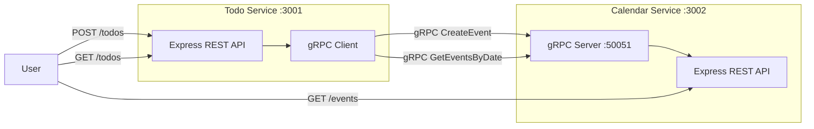
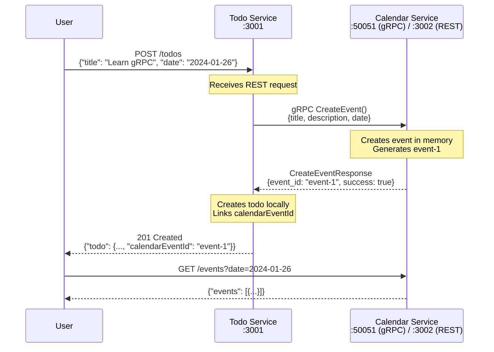
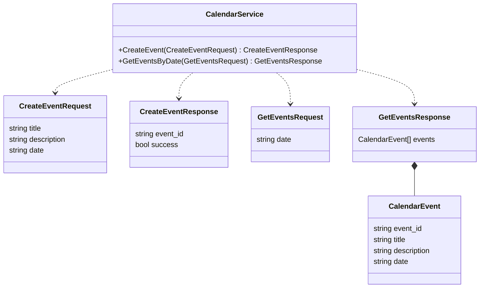
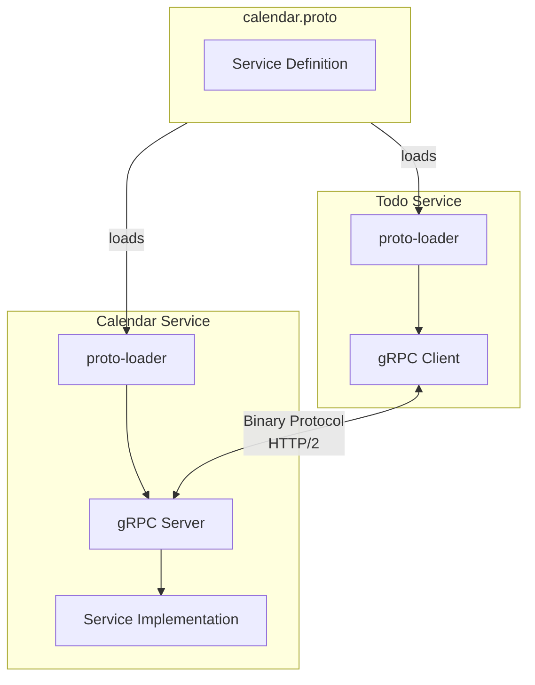

# gRPC Learning Project: Todo + Calendar Microservices

Two Express servers communicating via gRPC to demonstrate internal microservice communication.

## Architecture Overview



## Request Flow: Creating a Todo



## Project Structure

```
grpc-example/
├── proto/
│   └── calendar.proto          # gRPC service definition
├── todo-service/
│   ├── package.json
│   ├── index.js                # Express server + gRPC client
│   └── todos.js                # In-memory todo storage
├── calendar-service/
│   ├── package.json
│   ├── index.js                # Express server + gRPC server
│   └── events.js               # In-memory event storage
├── package.json                # Root (pnpm workspaces)
├── pnpm-workspace.yaml
└── README.md
```

## gRPC Service Definition



## Getting Started

### Install Dependencies

```bash
pnpm install
```

### Start the Services

```bash
# Terminal 1: Start Calendar Service (gRPC server + REST)
pnpm --filter calendar-service start

# Terminal 2: Start Todo Service (gRPC client + REST)
pnpm --filter todo-service start
```

### Test the Flow

```bash
# Create a todo (syncs to calendar via gRPC)
curl -X POST http://localhost:3001/todos \
  -H "Content-Type: application/json" \
  -d '{"title": "Learn gRPC", "description": "Its gonna be lit", "date": "2026-01-26"}'

# Check calendar events
curl http://localhost:3002/events?date=2026-01-26

# Get all todos
curl http://localhost:3001/todos
```

## API Endpoints

### Todo Service (`:3001`)

| Method | Endpoint | Description |
|--------|----------|-------------|
| POST | `/todos` | Create a todo (syncs to calendar) |
| GET | `/todos` | List all todos |

### Calendar Service (`:3002`)

| Method | Endpoint | Description |
|--------|----------|-------------|
| GET | `/events` | List all events |
| GET | `/events?date=YYYY-MM-DD` | Get events for a date |
| GET | `/events/:date` | Get events for a date |

## How gRPC Works Here



1. **Proto file** defines the contract between services
2. **proto-loader** dynamically loads the `.proto` file at runtime
3. **gRPC client** (Todo Service) makes RPC calls
4. **gRPC server** (Calendar Service) handles RPC calls
5. Communication uses **binary serialization over HTTP/2**

## Dependencies

- `express` - REST API framework
- `@grpc/grpc-js` - gRPC for Node.js (pure JS implementation)
- `@grpc/proto-loader` - Dynamic .proto file loading
